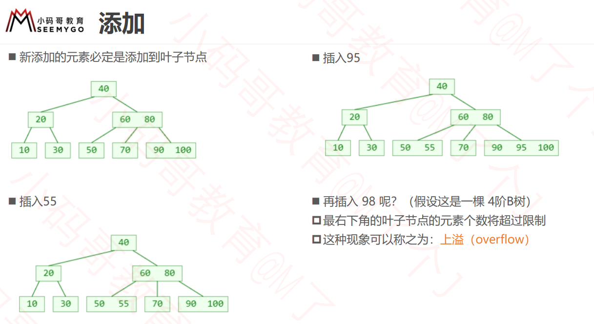
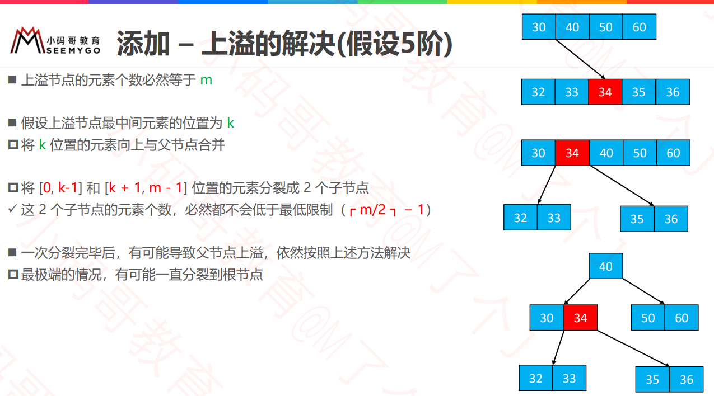

## B树
◼ B树是一种平衡的多路搜索树，多用于文件系统、数据库的实现

◼ 仔细观察B树，有什么眼前一亮的特点？

◼1 个节点可以存储超过 2 个元素、可以拥有超过 2 个子节点

◼拥有二叉搜索树的一些性质

◼平衡，每个节点的所有子树高度一致

◼比较矮

## m阶B树的性质（m≥2）

◼ 假设一个节点存储的元素个数为 x 

◼根节点：1 ≤ x ≤ m − 1 

◼非根节点：cell( m/2 ) − 1 ≤ x ≤ m − 1

◼如果有子节点，子节点个数 y = x + 1 ✓ 根节点：2 ≤ y ≤ m  

✓ 非根节点：cell( m/2 ) ≤ y ≤ m  

▶ 比如 m = 3，2 ≤ y ≤ 3，因此可以称为（2, 3）树、2-3树 

▶ 比如 m = 4，2 ≤ y ≤ 4，因此可以称为（2, 4）树、2-3-4树 

▶ 比如 m = 5，3 ≤ y ≤ 5，因此可以称为（3, 5）树 

▶ 比如 m = 6，3 ≤ y ≤ 6，因此可以称为（3, 6）树 

▶ 比如 m = 7，4 ≤ y ≤ 7，因此可以称为（4, 7）树

## B树 VS 二叉搜索树
◼ B树 和 二叉搜索树，在逻辑上是等价的

◼ 多代节点合并，可以获得一个超级节点

2代合并的超级节点，最多拥有 4 个子节点（至少是 4阶B树）

3代合并的超级节点，最多拥有 8 个子节点（至少是 8阶B树）

n代合并的超级节点，最多拥有 2^n个子节点（ 至少是 2^n阶B树）

◼ m阶B树，最多需要 log2m 代合并

## 搜索
◼ 跟二叉搜索树的搜索类似
1. 先在节点内部从小到大开始搜索元素
2. 如果命中，搜索结束
3. 如果未命中，再去对应的子节点中搜索元素，重复步骤 1

## 添加

### 添加 – 上溢的解决(假设5阶)
◼ 上溢节点的元素个数必然等于 m

◼ 假设上溢节点最中间元素的位置为 k

将 k 位置的元素向上与父节点合并

将 [0, k-1] 和 [k + 1, m - 1] 位置的元素分裂成 2 个子节点

✓ 这 2 个子节点的元素个数，必然都不会低于最低限制（┌ m/2 ┐ − 1）

◼ 一次分裂完毕后，有可能导致父节点上溢，依然按照上述方法解决

最极端的情况，有可能一直分裂到根节点

